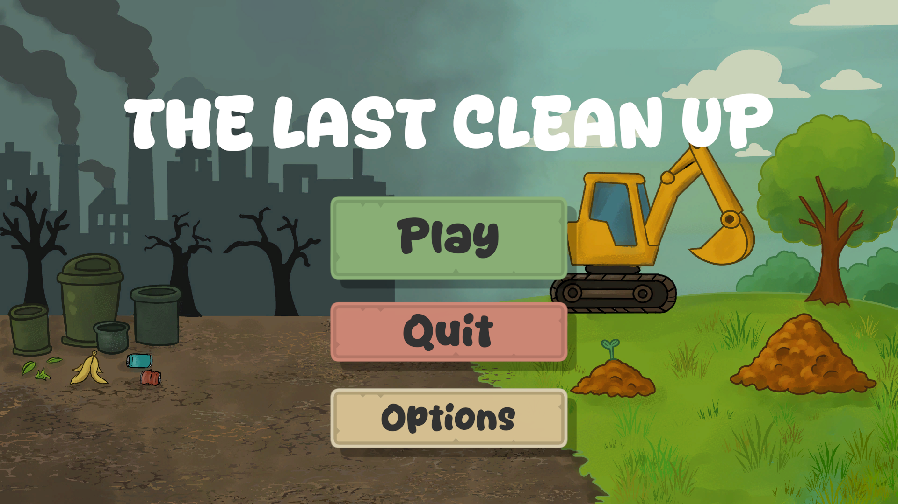
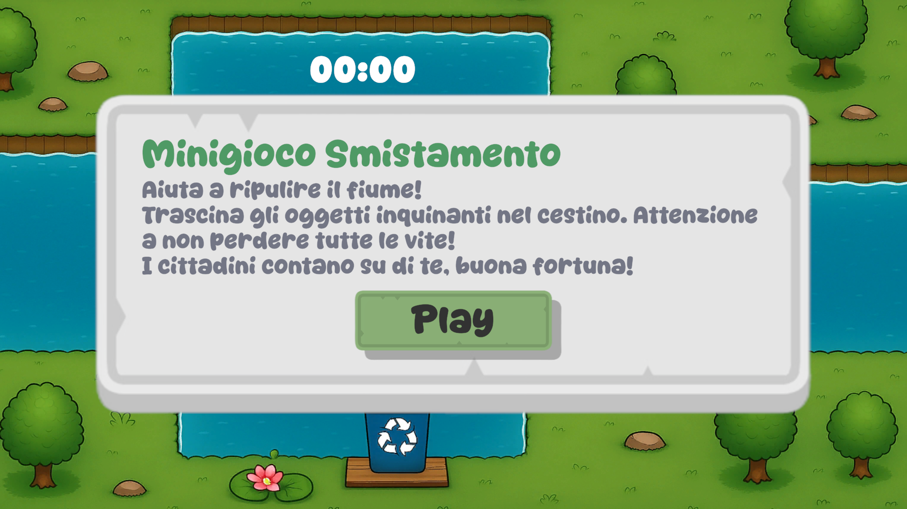
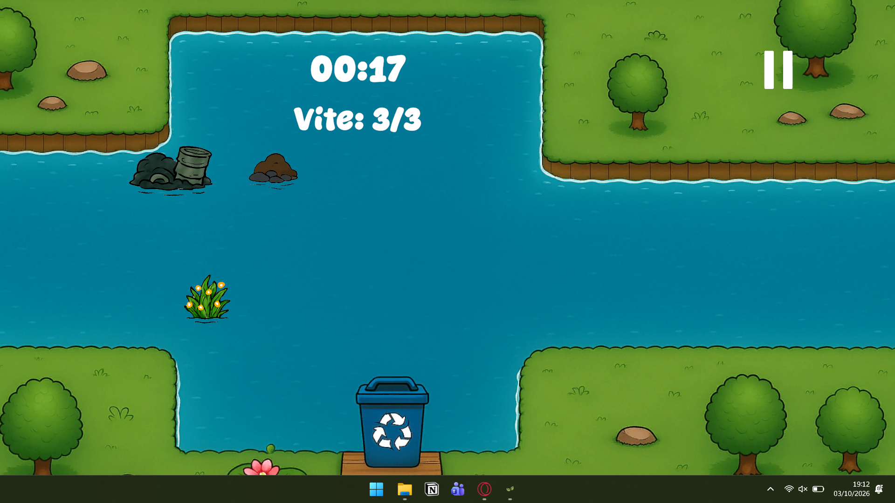
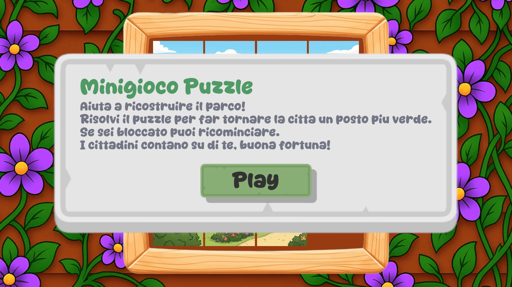
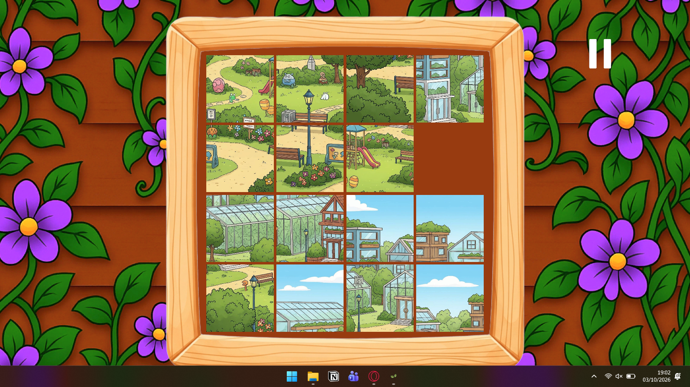

# TheLastCleanUp-Minigames - Minigame Scripts

This repository showcases my personal programming and design contributions to **The Last Clean Up**, a university project developed in a team of 4 people.

### 🎮 Project Context
The full project is a game that features three distinct minigames. Within our team, I took on the roles of **Game Designer** and **Minigame Designer** for the overall experience, while specifically handling the **Gameplay Programming** for two of the three minigames: *Sorting* and *Puzzle*. 

### 📸 Minigames Preview

**Smistamento (Sorting)**

  
  

**Puzzle**

  
  

Since the complete project contains art, core management systems, and a third minigame developed by my teammates, this repository serves to highlight **only my personal scripting work**.
